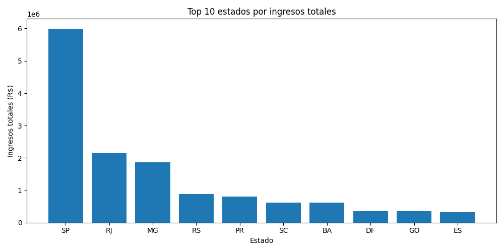

# Análisis Big Data — E-commerce Olist con PySpark

Proyecto de procesamiento distribuido sobre el dataset de e-commerce brasileño Olist, 
usando PySpark para joins, agregaciones y funciones de ventana a escala.

## Objetivo

Aplicar PySpark DataFrames para resolver preguntas de negocio sobre un dataset de ~100.000 
pedidos: ingresos por región, ranking de clientes de alto valor, distribución de pedidos por estado.

## Stack Tecnológico

- **Motor de procesamiento:** Apache Spark (PySpark)
- **Lenguaje:** Python
- **Librerías:** pyspark, pandas, matplotlib
- **Dataset:** [Brazilian E-Commerce (Olist), Kaggle](https://www.kaggle.com/datasets/olistbr/brazilian-ecommerce)
- **Entorno:** Google Colab

## Estructura del Repositorio
├── data/                       # CSVs de Olist (no incluidos, ver instrucciones)
├── notebooks/                  # Notebook con las transformaciones ejecutadas
├── images/                     # Gráficos generados
├── requirements.txt
└── README.md
## Transformaciones destacadas

- Joins distribuidos entre 3 tablas (orders, customers, payments)
- Ranking de clientes por gasto dentro de cada estado (Window function: `rank().over()`)
- Agregación de ingresos por región usando `groupBy` + `agg`

## Cómo ejecutarlo

1. Descarga el dataset desde [Kaggle](https://www.kaggle.com/datasets/olistbr/brazilian-ecommerce)
2. Abre `notebooks/01_analisis_pyspark.ipynb` en Google Colab
3. Sube los CSV cuando el notebook lo solicite
4. Ejecuta las celdas en orden

## Nota técnica

Este proyecto usa Spark para demostrar el manejo de la API de PySpark (joins distribuidos, 
window functions, groupBy) con un dataset manejable en Colab. En un caso real de producción, 
el mismo código escalaría sin cambios a volúmenes de terabytes en un clúster distribuido — 
la ventaja de Spark no es la velocidad en datasets pequeños, sino que el mismo paradigma de 
procesamiento funciona igual sin importar el tamaño de los datos.